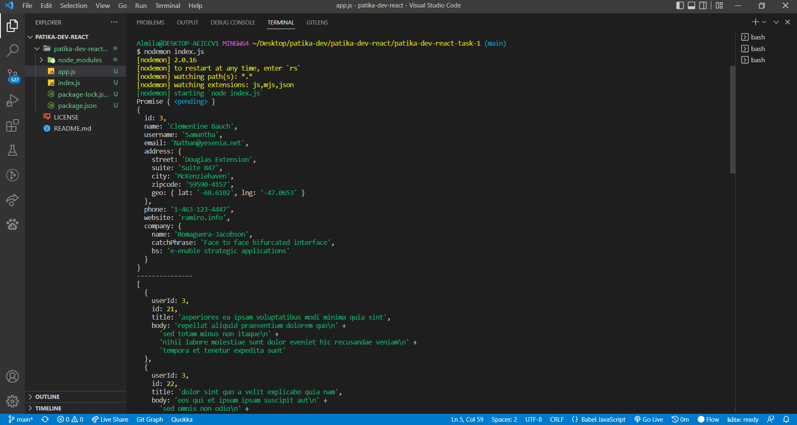
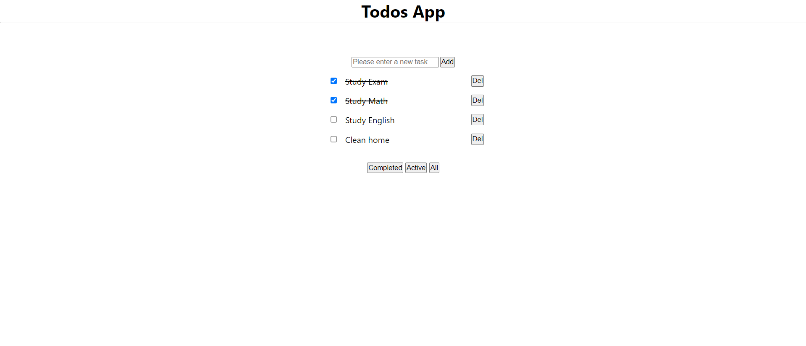
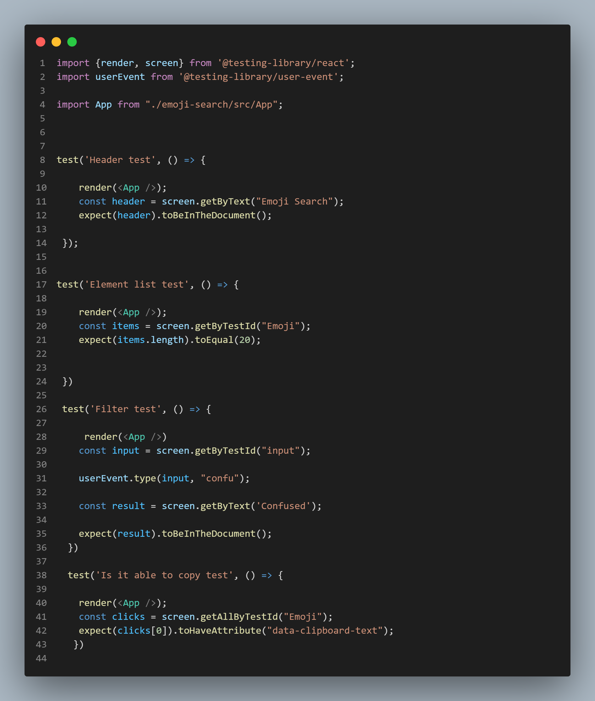
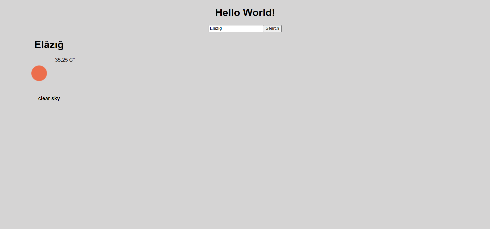

# Patikadev React

My solutions of patikadev-react-course.

[Patika.dev](https://patika.dev)

const newUrl =
"https://api.openweathermap.org/data/2.5/onecall?lat=38.7267&lon=-9.1403&exclude=current,hourly,minutely,alerts&units=metric&appid=8505ef711c854dffc0a4ee366a94ad5e";
